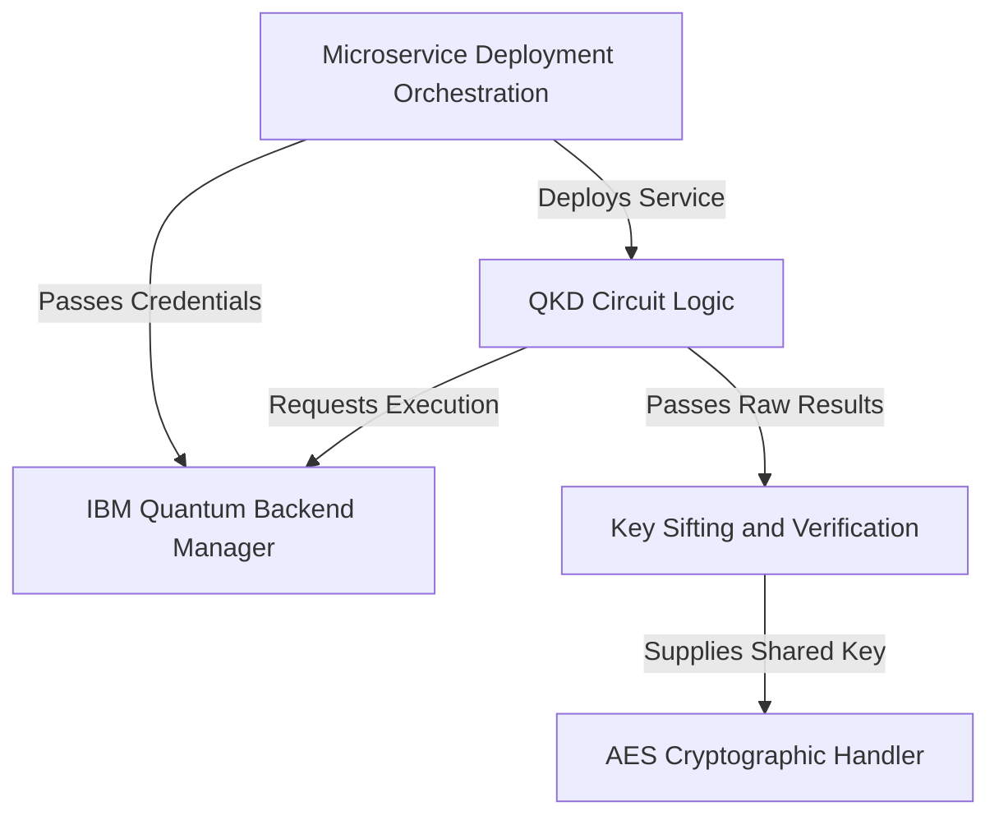

# AQVH-Final
# Tutorial: AQVH-Final

This project implements a demonstration of **Quantum Key Distribution** (*QKD*) using the BB84 protocol on real IBM quantum hardware. It first generates a quantum-secured secret key, performing crucial classical post-processing to detect eavesdroppers (Eve). If the key is deemed secure, it is immediately converted into a 256-bit key to perform industry-standard classical **AES encryption and decryption** of user messages, all hosted within a robust Dockerized *microservice* environment.


## Visual Overview



## Chapters

1. [Microservice Deployment Orchestration
](01_microservice_deployment_orchestration_.md)
2. [QKD Circuit Logic
](02_qkd_circuit_logic_.md)
3. [IBM Quantum Backend Manager
](03_ibm_quantum_backend_manager_.md)
4. [Key Sifting and Verification
](04_key_sifting_and_verification_.md)
5. [AES Cryptographic Handler
](05_aes_cryptographic_handler_.md)

# Chapter 1: Microservice Deployment Orchestration

Welcome to the world of secure quantum communication! Before we dive into the fascinating quantum mechanics that make this project possible, we first need to understand *how* we make our application run reliably. This first chapter is about structure—the blueprint we use to deploy our entire system.

## 1. The Big Problem: Tying Specialized Jobs Together

Imagine you are building a complex factory. You need two very different specialized departments:

1.  **The Engine Room (Backend):** This is where all the heavy lifting happens—the quantum calculations, key sifting, and cryptographic work. This needs Python and a powerful server setup (Gunicorn/Flask).
2.  **The Front Desk (Frontend):** This is the user interface. It needs to be fast, serve the website (HTML), and route user requests correctly to the Engine Room. This needs a high-performance web server (Nginx).

If we ran these two things separately, they wouldn't know how to talk to each other, and setting them up consistently on different computers would be a headache.

**The Solution? Microservice Deployment Orchestration.**

We use **Docker** to put each specialized department into its own self-contained box (a **Microservice**), and then we use **Docker Compose** as the manager that links these boxes together and defines their communication rules.

---

## 2. Key Components of Our Orchestration

Our application is built on two core microservices that work together:

| Component | Role in the Application | Analogy |
| :--- | :--- | :--- |
| **Flask (Backend)** | Executes the QKD and AES logic. This is the heavy computation engine. | The Chef (cooks the complex meal) |
| **Nginx (Frontend)** | Serves the main webpage and acts as a high-speed traffic cop, routing requests to the Flask service. | The Waiter / Host (greets customers and routes orders) |
| **Docker Compose** | The overall manager that starts both services and sets up the internal network. | The Restaurant Manager (opens the restaurant) |

## 3. Defining the Services with Docker Compose

`docker-compose.yml` is the blueprint. It tells the Docker Manager exactly what services to start and how to connect them.

Let's look at how we define our two services:

### 3.1. The Flask Backend Service (`flask`)

The Flask service is responsible for running the Python code that handles the quantum logic (using Gunicorn).

```yaml
services:
  flask:
    build: .
    container_name: flask_app
    env_file:
      - .env
    expose:
      - "8000"
```

**What this means:**
1.  `build: .`: Use the `Dockerfile` we have locally to build this service (we'll look inside the `Dockerfile` later).
2.  `container_name: flask_app`: Give it a friendly name.
3.  `expose: "8000"`: This service listens internally on port 8000. **Important:** `expose` means other services in our network can talk to it, but the outside world (you, the user) cannot talk directly to port 8000.

### 3.2. The Nginx Frontend Service (`nginx`)

Nginx is the web server. It is the only service visible to the public internet.

```yaml
  nginx:
    image: nginx:latest
    container_name: nginx_server
    ports:
      - "80:80"
    volumes:
      # Nginx config and HTML template mounted here...
    depends_on:
      - flask
```

**What this means:**
1.  `image: nginx:latest`: We use a standard, high-performance web server image.
2.  `ports: "80:80"`: This is critical! This maps the internal Nginx port 80 to your computer's port 80 (standard HTTP), making the application accessible via `http://localhost`.
3.  `depends_on: flask`: This tells the Manager: "Do not start Nginx until the Flask service is running and ready." This ensures communication is possible from the beginning.

## 4. The Magic of the Reverse Proxy

When you visit our application in your web browser, you talk to Nginx on port 80. Nginx performs a crucial role called a **Reverse Proxy**.

1.  **Simple Request:** If you just ask for the main page (`/`), Nginx serves the HTML file directly and very quickly.
2.  **API Request:** If you click a button that sends an instruction like "Start the QKD process" (which goes to `/api/start`), Nginx doesn't handle the complex logic itself. Instead, it looks at its configuration file (`default.conf`) and says: "Ah, this is an API request! I must forward this internally to the `flask` service waiting on port 8000."

This division of labor makes the application fast and secure.

### How Nginx Gets Its Configuration

Nginx needs to know where to route the API requests. We provide it with a configuration file via the `volumes` section:

```yaml
    volumes:
      # FIX 1: Point to the 'nginx' folder for the config
      - ./nginx/default.conf:/etc/nginx/conf.d/default.conf
      
      # FIX 2: Point to the 'templates' folder for the HTML file
      - ./templates/index.html:/usr/share/nginx/html/index.html
```
This tells Docker Compose to "mount" our local configuration files (`default.conf` and `index.html`) directly into the running Nginx container, so it knows the rules of the road.

## 5. Deployment Lifecycle Walkthrough

When you run the command to start the application (usually `docker compose up`), here is the step-by-step process orchestrated by Docker Compose:

```mermaid
sequenceDiagram
    participant User: You (via terminal)
    participant DockerCompose: The Manager
    participant Flask: Python Server (8000)
    participant Nginx: Web Server (80)

    User->>DockerCompose: Run 'docker compose up'
    DockerCompose->>Flask: Build/Start Python service
    Note over Flask: Flask starts Gunicorn server on internal port 8000
    DockerCompose->>Nginx: Check dependency (Wait for Flask)
    DockerCompose->>Nginx: Start Nginx service
    Note over Nginx: Nginx opens public port 80 and loads config

    User->>Nginx: Request website (http://localhost)
    Nginx-->>User: Sends main HTML page
    User->>Nginx: Request QKD Key Generation (/api/qkd)
    Nginx->>Flask: Routes request (Internal Network)
    Note over Flask: Executes [QKD Circuit Logic](02_qkd_circuit_logic_.md)
    Flask-->>Nginx: Sends result (Key data)
    Nginx-->>User: Sends result back to browser
```

## 6. Building the Flask Engine (The Dockerfile)

How does our Manager (`docker-compose.yml`) build the actual `flask` engine? It uses the `Dockerfile`:

```dockerfile
FROM python:3.10-slim

WORKDIR /app

COPY requirements.txt .
RUN pip install --no-cache-dir -r requirements.txt

COPY . .

# CMD runs the Gunicorn server, making Flask available on 8000
CMD ["gunicorn", "-b", "0.0.0.0:8000", "--timeout", "600", "app:app"]
```

This short file defines the environment: it starts with a base Python image, installs all necessary libraries (including Qiskit for the quantum work), copies our application code, and finally runs the Python server using **Gunicorn**. Gunicorn is the production-ready server that actually hosts our application logic (`app:app`) and ensures it is ready to receive requests on port 8000. The `--timeout 600` is important because quantum jobs sometimes take several minutes to run on remote hardware!

## Conclusion

We have successfully set up the basic structure of our secure communication application. We packaged the computation engine (Flask/Gunicorn) and the web interface (Nginx) into separate, specialized containers and used Docker Compose to manage them. Nginx acts as the public entry point, serving static files and correctly forwarding API requests to our hidden Flask quantum logic server.

Now that the "factory" is built and the manager is in place, we can move on to the actual work being done inside the engine room!

The next chapter will detail the most exciting part: how we use quantum mechanics to create uncrackable keys.

[QKD Circuit Logic](02_qkd_circuit_logic_.md)
# Chapter 2: QKD Circuit Logic

In the last chapter, [Microservice Deployment Orchestration](01_microservice_deployment_orchestration_.md), we built the sturdy foundation—the "Engine Room" (Flask) and the "Front Desk" (Nginx). Now, it’s time to look inside the Engine Room and see the most exciting piece of machinery: the **Quantum Key Distribution (QKD) circuit**.

This chapter is about translating the rules of the BB84 quantum protocol into executable instructions for a quantum computer using the Qiskit library.

## 1. The Core Idea: Secret Keys Guaranteed by Physics

Our main goal is to allow two parties, Alice and Bob, to create a secret cryptographic key, bit by bit. The trick is that they use fragile quantum particles (qubits) to transmit these bits.

**The Rule of Quantum Physics (Simplified):** If an eavesdropper (Eve) tries to measure a qubit, the act of measurement fundamentally changes the qubit's state.

This means if Alice and Bob detect errors in their shared key, they know Eve was spying. This detection is built right into the circuit logic.

We break the entire key generation process into three stages, simulating the journey of a single qubit from Alice to Bob:

| Stage | Actor | Classical Input | Quantum Action |
| :--- | :--- | :--- | :--- |
| **1. Preparation** | Alice | Random Bit (0/1) + Random Basis (Z/X) | Creates the qubit state |
| **2. Interception** | Eve (Optional) | Random Basis (Z/X) | Measures the qubit mid-flight |
| **3. Measurement** | Bob | Random Basis (Z/X) | Reads the final qubit result |

## 2. Alice's Preparation: Encoding Bits into Qubits

Alice must encode a classical bit (0 or 1) into a qubit. She needs two pieces of information for every qubit she sends:

1.  **The Bit Value:** Should the qubit represent 0 or 1?
2.  **The Basis:** What "viewing angle" should she use to send the bit? (Standard Z-Basis or Diagonal X-Basis).

In Qiskit, we use specific gates to represent these choices:

*   If the bit is **1**, we use the **X-gate** (the NOT gate) to flip the state from 0 to 1.
*   If the basis is **X** (Diagonal), we use the **Hadamard (H) gate** to rotate the qubit.

Let's see this in the `app.py` code where we construct the quantum circuit (`qc`):

```python
# Create a circuit with 'bit_num' qubits and 'bit_num' classical bits
qc = QuantumCircuit(bit_num, bit_num) 

# --- Alice's Preparation ---
for i in range(bit_num):
    # 1. Encode the bit value (0 or 1)
    if alice_bits_prep[i] == 1:
        qc.x(i)
        
    # 2. Encode the basis (0=Z, 1=X)
    if alice_bases[i] == 1:
        qc.h(i) 
```

This short loop runs for every bit Alice wants to send, ensuring the correct `X` and `H` gates are placed, creating the initial quantum message.

## 3. Eve's Interception: The Error Source

In the QKD simulation, we include an optional "Eve" mode to demonstrate why QKD is secure. If Eve tries to spy, she must perform a measurement.

The key step here is the **mid-circuit measurement**. This measurement fundamentally changes the quantum state, potentially corrupting Alice's original bit if Eve chose the wrong basis to look at it.

```python
# --- Eve's Interception ---
if mode == "eve":
    # Eve randomly chooses a basis (H or I)
    eve_bases = np.round(rng.random(bit_num)).astype(int)
    for i in range(bit_num):
        if eve_bases[i] == 1:
            qc.h(i)
        
        # CRITICAL FIX: Eve must MEASURE to collapse the state!
        qc.measure(i, i)
        
        # Eve rotates back (Hides the evidence)
        if eve_bases[i] == 1:
            qc.h(i)
```

The `qc.measure(i, i)` line is where the magic (and the potential error) happens. If Eve's random basis choice happens to mismatch Alice's basis choice, the measurement will scramble the information, and Bob will later receive a corrupted bit.

We use a `qc.barrier()` after Alice and Eve (if present) to show a separation in the circuit diagram:

```python
qc.barrier()
```

## 4. Bob's Measurement: Reading the Result

Bob receives the qubits that Alice sent (and Eve possibly interfered with). Like Alice, Bob has randomly generated bases.

Bob must first apply his chosen basis rotation, and then he uses the final measurement to turn the qubit back into a classical 0 or 1.

```python
# --- Bob's Measurement ---
for i in range(bit_num):
    # 1. Apply Bob's chosen basis (Hadamard if Basis=X)
    if bob_bases[i] == 1:
        qc.h(i)
    
    # 2. Final measurement: records the result into the classical register
    qc.measure(i, i)
```

After this phase, the quantum circuit is complete. It represents the entire communication flow.

## 5. Summary: The Circuit Lifecycle

The logic translates the classical random choices of Alice, Eve, and Bob into a single quantum circuit structure, ready for execution.

Here is the entire process for a single qubit, as defined in `app.py`:

```mermaid
sequenceDiagram
    participant Alice: Preparation
    participant Eve: Interception (Optional)
    participant Bob: Measurement
    participant Qiskit: Quantum Circuit (qc)

    Alice->>Qiskit: Add X Gate (If Bit=1)
    Alice->>Qiskit: Add H Gate (If Basis=X)
    Note over Qiskit: Qubit is prepared
    
    Eve->>Qiskit: (If Spy Mode) Add Eve's H Gate
    Eve->>Qiskit: (If Spy Mode) Add MEASURE (Causes State Collapse)
    Eve->>Qiskit: (If Spy Mode) Add Eve's H Gate
    
    Bob->>Qiskit: Add Bob's H Gate (If Basis=X)
    Bob->>Qiskit: Add FINAL MEASURE
    Note over Qiskit: Classical bit is recorded
```

Once this circuit is fully constructed, it is ready to be sent off to be calculated. The results from the final measurement are what we call `bob_bits_measured`. These are the bits Bob actually received.

## 6. What Happens Next?

The constructed quantum circuit, containing all the instructions for Alice's encoding, Eve's potential disruption, and Bob's decoding, is now compiled.

But how do we execute this complex sequence of gates? We don't run it locally on our Flask server; we send it to a real (or simulated) quantum computer provided by IBM.

In the next chapter, we will leave the world of circuit construction and learn how our application securely connects to and manages jobs on the IBM quantum backend.

[IBM Quantum Backend Manager](03_ibm_quantum_backend_manager_.md)
# Chapter 3: IBM Quantum Backend Manager

In [QKD Circuit Logic](02_qkd_circuit_logic_.md), we successfully designed the quantum circuit—the sequence of gates representing Alice's encoding and Bob's decoding. Now, we face a crucial infrastructure question: **How do we actually run this circuit on a real quantum computer?**

We cannot execute complex quantum gates on a standard local laptop. We must send our instructions to specialized, large, and sensitive hardware hosted in IBM's remote data centers.

This is where the **IBM Quantum Backend Manager** comes in. It is a critical layer of abstraction that handles all the complicated steps needed to go from a Python circuit definition to getting actual results from remote quantum hardware.

## 1. The Problem: Connecting to a Shared, Busy Resource

Imagine trying to access a highly specialized, secure research laboratory that is shared by thousands of scientists globally. You face three main problems:

1.  **Authentication:** You need a specific ID (token) to prove you are allowed inside.
2.  **Availability:** Which machines are currently working? Are any down for maintenance?
3.  **Queue Time:** Which working machine has the shortest waiting line?

The Backend Manager solves all three problems automatically, ensuring our QKD key generation runs quickly and successfully every time.

## 2. The Manager's Three Core Responsibilities

Our backend manager code (`get_ibm_backend()` in `app.py`) is designed around efficiency and reliability.

### A. The Gatekeeper: Authentication and Security

Before anything else, the Manager uses your secret API token (stored in the `.env` file) to authenticate with the IBM Quantum services. This creates a secure, verifiable connection point using the `QiskitRuntimeService`.

### B. Lazy Loading: Connecting Only When Needed

Connecting to a major cloud service takes time and resources. If our application starts up and waits for hours before a user runs a job, the connection might time out or become stale.

The Manager uses a technique called **Lazy Loading**. It checks if a connection has already been established and saved (**cached**). If not, *only then* does it initiate the connection process.

This saves resources and ensures we always have a fresh connection right when we need it.

```python
# File: app.py (Simplified)
cached_backend = None 

def get_ibm_backend():
    global cached_backend
    
    # Check the cache first (Lazy Load)
    if cached_backend:
        return cached_backend

    print("🔌 Initiating connection to IBM Quantum...")
    # ... connection logic proceeds ...
```

### C. Automatic Selection: Finding the Least Busy Machine

This is the most powerful feature. IBM hosts many different quantum computers (like 'ibm\_osaka' or 'ibm\_kyoto'). These machines have different performance characteristics and, crucially, different queue lengths.

The Manager uses the `service.least_busy()` function to automatically scan all operational (non-broken) quantum computers and select the one with the shortest queue.

```python
# File: app.py (Simplified Connection Logic)

def connect_and_select():
    # 1. Authenticate using environment variables
    service = QiskitRuntimeService(
        channel="ibm_cloud",
        token=IBM_TOKEN,
        instance=IBM_INSTANCE
    )
    
    # 2. Find the best available hardware
    backend = service.least_busy(operational=True, simulator=False)
    
    # 3. Cache the result for next time
    cached_backend = backend 
    
    print(f"✅ Connected to: {backend.name}")
    return backend
```
By setting `operational=True` and `simulator=False`, we ensure we target a real, functioning quantum computer, not a simulation running on a classical server.

## 3. Workflow: Submitting the Quantum Job

When a user clicks the "Run QKD" button on the frontend, the Flask backend executes the quantum circuit. Here is the exact sequence of events managed by the Backend Manager:

```mermaid
sequenceDiagram
    participant FlaskApp: Flask App (Request)
    participant Manager: Backend Manager (Code)
    participant IBMService: IBM Quantum Service
    participant QuantumPC: Selected Quantum Computer

    FlaskApp->>Manager: Call get_ibm_backend()
    Note over Manager: Check if connection is cached (It's not yet)
    Manager->>IBMService: Authenticate & Request Available QCs
    IBMService-->>Manager: List of Operational QCs (and their queue times)
    Manager->>Manager: Select 'Least Busy' PC (e.g., 'ibm_cairo')
    Manager->>Manager: Cache Connection
    Manager-->>FlaskApp: Return the 'ibm_cairo' connection object

    Note over FlaskApp: Now we have a connection to the chosen backend.

    FlaskApp->>QuantumPC: Submit QKD Circuit Job (via Sampler)
    QuantumPC-->>FlaskApp: Return Measurement Results (0s and 1s)
```

## 4. Submitting the Circuit

Once the Manager has successfully provided the connection object (`backend`), the Flask application uses two key steps before the job is actually sent:

### Step 1: Transpilation (Translation)

Every quantum computer chip is slightly different. Our beautiful QKD circuit (Chapter 2) needs to be translated into the specific language and structure of the chosen physical machine (`backend.name`). This translation process is called **transpilation**.

```python
# File: app.py (Part of run_qkd)

# Use the retrieved backend to translate the circuit
pm = generate_preset_pass_manager(backend=backend, optimization_level=1)
isa_qc = pm.run(qc) # isa_qc is the translated circuit
```
This ensures the quantum computer can physically execute our instructions efficiently.

### Step 2: Running the Job

Finally, we use the `Sampler` (a specialized tool in Qiskit designed for measurement tasks like QKD) and run the translated circuit (`isa_qc`) on the selected `backend`.

```python
# File: app.py (Part of run_qkd)

sampler = Sampler(mode=backend)
        
# Run job (Shots=1 because QKD only needs one run per bit string)
job = sampler.run([isa_qc], shots=1)

# Wait for the result (This is where the application waits for the remote PC)
result = job.result() 
```

The `job.result()` line is where the Backend Manager proves its worth. It handles the secure transmission of the circuit, monitors its progress in the remote queue, and retrieves the final measurement results, which the rest of our application then uses.

The result is a set of counts (like `{'10101': 1}`), indicating the final measurement Bob obtained for all the qubits.

## Conclusion

The IBM Quantum Backend Manager is the secure, intelligent intermediary that connects our application logic to the physical world of quantum computing. It manages complex authentication, ensures we connect efficiently via lazy loading, and automatically optimizes our experiment time by selecting the least busy hardware.

Now that we have successfully run the quantum circuit and received the raw measured bits, the next step is to analyze those results. We need to determine which bits are useful and calculate if any eavesdropping occurred.

The next chapter will cover this crucial analysis step: [Key Sifting and Verification](04_key_sifting_and_verification_.md).
# Chapter 4: Key Sifting and Verification

In the previous chapters, we built the structure ([Microservice Deployment Orchestration](01_microservice_deployment_orchestration_.md)), defined the rules ([QKD Circuit Logic](02_qkd_circuit_logic_.md)), and executed the job on remote hardware ([IBM Quantum Backend Manager](03_ibm_quantum_backend_manager_.md)).

The quantum computer has now sent us its raw results: a long string of 0s and 1s that Bob measured.

However, this raw string is useless by itself. Why? Because Bob chose his measurement basis (Z or X) randomly, and Alice chose her encoding basis (Z or X) randomly. They didn't coordinate yet!

This chapter explains the essential **classical post-processing** step: how Alice and Bob agree on which bits are actually secret and how they check if an eavesdropper (Eve) has corrupted their communication. This process is called **Key Sifting and Verification**.

---

## 1. Step 1: Key Sifting (Finding the Good Bits)

The foundational principle of QKD is that if Alice and Bob use different measurement bases (one used Z, the other used X), the measurement result will be completely random, regardless of what Alice originally sent.

We need to discard all these random bits.

### The Sifting Rule

Alice and Bob communicate publicly (via a standard internet channel, which is *not* secure for key exchange but is secure for metadata exchange) and compare their lists of bases.

| Bit Index | Alice's Base | Bob's Base | Alice's Bit | Bob's Result | Outcome |
| :--- | :--- | :--- | :--- | :--- | :--- |
| 1 | Z | Z | 0 | 0 | **KEEP** (Bases Matched) |
| 2 | Z | X | 1 | 0 | **DISCARD** (Bases Mismatched) |
| 3 | X | X | 1 | 1 | **KEEP** (Bases Matched) |
| 4 | X | Z | 0 | 1 | **DISCARD** (Bases Mismatched) |

The raw bits that remain after discarding the mismatched ones form the **raw secret key**.

### How Sifting is Implemented

In our application, this happens immediately after we retrieve the final measurement results (`bob_bits_measured`) from the quantum computer. We loop through every bit and apply the rule.

```python
# File: app.py (Simplified Sifting Logic)

# Lists to hold the bits where the bases matched
agoodbits, bgoodbits = [], []
total_compared_bits = 0

for n in range(bit_num):
    # CRITICAL: Check if Alice and Bob used the same basis
    if alice_bases[n] == bob_bases[n]:
        
        # YES! Keep the original bit Alice sent and the final result Bob measured.
        total_compared_bits += 1
        agoodbits.append(int(alice_bits_prep[n]))
        bgoodbits.append(int(bob_bits_measured[n]))

# The resulting list 'agoodbits' is the Raw Secret Key
shared_key_bits = agoodbits[:]
```

The sifting process usually eliminates about half of the original bits, but the remaining bits are the ones that have a high probability of being identical (unless Eve was spying).

## 2. Step 2: Key Verification (Detecting Eve)

Now that Alice and Bob have a raw key, they must ensure its integrity. This is where QKD proves its security: if the key is corrupted, they know they were spied on.

### The Quantum Bit Error Rate (QBER)

The metric used to verify the key is the **Quantum Bit Error Rate (QBER)**.

1.  **Agreement:** Alice and Bob agree to publicly reveal a small, random subset (say, 10%) of their shared key bits.
2.  **Comparison:** They compare these publicly revealed bits. If Alice's bit is 0 but Bob's bit is 1, that counts as **one error**.
3.  **Calculation:** QBER is the percentage of error bits found in the sample.

If Eve measured the qubits during transmission (as simulated in the "eve" mode in Chapter 2), she would have chosen the wrong basis about half the time. This intervention introduces errors into the key, increasing the QBER.

| Scenario | QBER Result | Action |
| :--- | :--- | :--- |
| **No Spy** | QBER is low (0% - 7%) | The key is secure. Proceed to encryption. |
| **Eve Spied** | QBER is high (11%+) | The key is insecure. Abort and start over. |

### QBER Calculation in Code

During the sifting loop, we simultaneously calculate the errors by comparing Alice's original bit with Bob's final measured bit for every "good" bit:

```python
# File: app.py (Simplified Error Calculation)

# Inside the 'if alice_bases[n] == bob_bases[n]' block:

    # ... (sifting happens here) ...
    
    # 2. THE ERROR CHECK
    if int(alice_bits_prep[n]) == int(bob_bits_measured[n]):
        # Match found!
        match_count += 1
    else:
        # Error found!
        error_bits_count += 1

# After the loop finishes:
loss = error_bits_count / total_compared_bits
qber_percent = loss * 100
```

### Example: The Spy Effect

If we run the QKD circuit in the standard "base" mode, the QBER will be close to 0%. Any small errors come from noise on the real quantum hardware.

If we run the QKD circuit in the "eve" mode (as defined in [QKD Circuit Logic](02_qkd_circuit_logic_.md)), Eve's measurements scramble the bits, resulting in a QBER of approximately 25% (since half the bits were mismatched bases, and Eve caused an error 50% of *those* times, leading to a total error in the sifted key of ~25%).

A 25% QBER clearly shows Eve's presence, forcing Alice and Bob to immediately discard the key.

## 3. Workflow Summary

The Key Sifting and Verification process is the critical point where the quantum communication ends, and the classical use of the key begins.

```mermaid
sequenceDiagram
    participant Quantum Results: Bob's Measured Bits
    participant Alice Data: Alice's Bases/Bits
    participant Sifting: Sifting Logic
    participant Verification: QBER Calculation
    participant Final Key: Secure Shared Key

    Quantum Results->>Sifting: Receive Bob's Bits
    Alice Data->>Sifting: Receive Alice's Bases
    
    Sifting->>Sifting: Compare Bases, Discard Mismatches
    Note over Sifting: Generates Raw Secret Key
    
    Sifting->>Verification: Send Raw Key
    Verification->>Verification: Compare public subset of bits
    
    Verification->>Verification: Calculate QBER
    
    alt QBER is High (Eve detected)
        Verification->>Final Key: Abort, Key Discarded
    else QBER is Low
        Verification->>Final Key: Key Secured for Encryption
    end
```

## Conclusion

Key Sifting and Verification ensures that the key derived from the quantum transmission is both reliable (Alice and Bob have the same sequence of bits) and secure (the error rate is low enough to prove no major eavesdropping occurred). This classical post-processing transforms the raw quantum results into a usable, certified secret key.

Once the key is certified as secure (low QBER), it is ready for its ultimate purpose: encrypting and decrypting messages.

The final step in our project is learning how we use this quantum-generated key to secure classical data using industrial-strength cryptography.

[AES Cryptographic Handler](05_aes_cryptographic_handler_.md)
# Chapter 5: AES Cryptographic Handler

In our journey so far, we have built the system infrastructure ([Microservice Deployment Orchestration](01_microservice_deployment_orchestration_.md)), used quantum mechanics to generate a bit string ([QKD Circuit Logic](02_qkd_circuit_logic_.md)), successfully run that logic on remote quantum hardware ([IBM Quantum Backend Manager](03_ibm_quantum_backend_manager_.md)), and verified the key's security classically ([Key Sifting and Verification](04_key_sifting_and_verification_.md)).

We now have the final product of the entire QKD process: a list of shared, secret, highly random bits (`shared_key_bits`).

The ultimate purpose of this quantum key is to secure classical data. This final chapter explains the **AES Cryptographic Handler**, the component that bridges the quantum world to the classical internet by applying this unique key to encrypt and decrypt messages using the industry-standard **Advanced Encryption Standard (AES)**.

---

## 1. The Necessity: Making the Key Usable

A cryptographic key must meet certain requirements to be used by industrial-strength encryption algorithms. Our raw QKD key, while secure, doesn't immediately fit the mold.

| Characteristic | QKD Raw Key | AES Standard Key |
| :--- | :--- | :--- |
| **Format** | List of integers (e.g., `[0, 1, 0, 1]`) | Fixed-length sequence of bytes (Binary data) |
| **Length** | Variable (depends on circuit size) | Fixed at 32 bytes (256 bits) for AES-256 |

The AES Cryptographic Handler performs the initial formatting step to convert our quantum-derived bit string into a perfect 256-bit AES key.

### Step 1: Converting Bits to a Fixed-Length Key

We use a helper function, `get_aes_key_from_bits`, to ensure the key is exactly 32 bytes long (256 bits), padding it if necessary, though in practice, our QKD run usually generates enough bits.

```python
# File: app.py (Helper function)

def get_aes_key_from_bits(key_bits):
    """Converts QKD bits into a 32-byte AES key."""
    if not key_bits: return None
    
    # 1. Join the list of bits into a single binary string
    key_str = "".join(map(str, key_bits))
    
    # 2. Convert the binary string to raw bytes
    num_bytes = (len(key_str) + 7) // 8
    key_bytes = int(key_str, 2).to_bytes(num_bytes, byteorder='big')
    
    # 3. Ensure the key is exactly 32 bytes (256 bits) long
    return key_bytes[:32]
```

Once this function runs, we have a true, usable, 256-bit secret key, guaranteed by quantum physics.

## 2. Securing the Message: AES Encryption

The handler uses the `cryptography.hazmat` library, a modern and secure implementation of cryptographic standards in Python. We utilize **AES-256** in **Cipher Block Chaining (CBC)** mode.

**Why CBC Mode?** CBC is a standard mode that links the encryption of the current block of data to the result of the previous block. This means identical sections of plaintext encrypt differently, which prevents patterns from being exploited by attackers.

For CBC mode to work securely, it requires two things:

1.  **The Key:** Our 256-bit quantum key.
2.  **The Initialization Vector (IV):** A random, non-secret 16-byte value used only once per encryption. *Analogy: If the Key is the type of lock, the IV is the random starting position of the tumblers.*

### The Encryption Workflow

When a user submits a message to the `/encrypt` endpoint, here is the sequence of events:

```mermaid
sequenceDiagram
    participant User: Message ("Secret Text")
    participant Handler: AES Cryptographic Handler
    participant Key: 256-bit QKD Key
    participant Ciphertext: Encrypted Output

    User->>Handler: Request Encryption
    Handler->>Key: Retrieve secure bytes
    Handler->>Handler: Generate 16 random bytes (IV)
    Note over Handler: IV is critical for CBC security.
    Handler->>Handler: Add Padding (PKCS7) to Message
    Handler->>Handler: Encrypt using AES-256-CBC(Key, IV)
    Handler-->>Ciphertext: Base64(IV + Ciphertext)
```

### Code Walkthrough: Encryption

The key steps in the `/encrypt` route handle padding and the actual cipher process.

```python
# File: app.py (Inside encrypt function)

# 1. Get the key and generate a fresh, random IV
key = get_aes_key_from_bits(shared_key_bits)
iv = os.urandom(16)

# 2. Padding: Ensures the message fits perfectly into AES blocks
padder = padding.PKCS7(128).padder()
padded_data = padder.update(text.encode('utf-8')) + padder.finalize()
        
# 3. Initialize the cipher with our quantum key and the IV
cipher = Cipher(algorithms.AES(key), modes.CBC(iv), backend=default_backend())
encryptor = cipher.encryptor()

# 4. Perform the encryption
ciphertext = encryptor.update(padded_data) + encryptor.finalize()
```

The final output is the combination of the IV and the encrypted message, all encoded for easy transmission over the internet.

## 3. Retrieving the Message: AES Decryption

Decryption is the reverse process. Since AES is a symmetric algorithm, Alice and Bob use the **exact same key** for both encryption and decryption.

To decrypt the message, the handler performs three inverse steps:

1.  **Separate IV and Ciphertext:** The handler must split the incoming encrypted string back into the IV and the actual ciphertext.
2.  **Decrypt:** Use the key and the IV in CBC mode to reverse the process.
3.  **Remove Padding:** Unpad the message to reveal the original plaintext.

### Code Walkthrough: Decryption

The `/decrypt` route handles the unwrapping of the secured message.

```python
# File: app.py (Inside decrypt function)

# 1. Get the quantum key
key = get_aes_key_from_bits(shared_key_bits)
encrypted_data = base64.b64decode(encrypted_msg_b64)
        
# 2. Separate the IV (first 16 bytes) from the ciphertext
iv = encrypted_data[:16]
actual_ciphertext = encrypted_data[16:]
        
# 3. Initialize the cipher using the KEY and the extracted IV
cipher = Cipher(algorithms.AES(key), modes.CBC(iv), backend=default_backend())
decryptor = cipher.decryptor()
padded_plaintext = decryptor.update(actual_ciphertext) + decryptor.finalize()
        
# 4. Unpad the message to get the original text
unpadder = padding.PKCS7(128).unpadder()
plaintext = unpadder.update(padded_plaintext) + unpadder.finalize()
```

If the key used for decryption does not exactly match the key used for encryption, the decryption will fail, resulting in scrambled, unreadable data.

## 4. The Final Security Guarantee

The AES Cryptographic Handler completes the objective of the entire project: it guarantees that the data secured by the key is protected by the same physical laws that govern the key's creation.

The security of the data now rests on two factors:

1.  **Key Strength:** The AES-256 algorithm is considered unbreakable by today's classical computers.
2.  **Key Source:** The key itself is fundamentally random and its secrecy was guaranteed through the QKD process (proven by a low QBER during [Key Sifting and Verification](04_key_sifting_and_verification_.md)).

Even if an attacker intercepts the entire encrypted message (the ciphertext), without the truly secret quantum-derived 256-bit key, they cannot read the message.

## Conclusion

The AES Cryptographic Handler is the functional output of our quantum security project. It successfully transforms a raw quantum bit string into a standardized, robust 256-bit key, which is then immediately used to encrypt and decrypt sensitive classical messages using the AES algorithm in CBC mode. This demonstrates the seamless integration of quantum key distribution with mature, high-speed classical cryptography, creating a secure communication channel resistant to all known eavesdropping attempts.

This chapter concludes our tutorial on the `AQVH-Final` project components.
